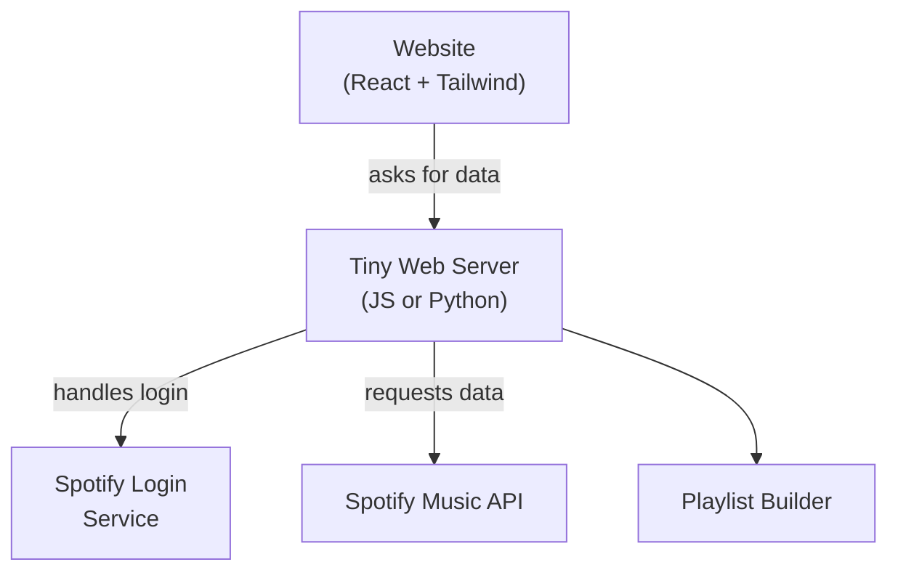

# playlist_lab
Learn-by-building project that teaches OAuth, APIs, and Docker.

### Goals

 - Using and learning a complete web stack (OAuth → API → UI → container)
 - Explore Docker & containerized deploys

### Primary User Stories (V1)

**1. Authenticate with Spotify (core scope):**
- As a logged-in user, I can connect my Spotify account so the app can read my library and manage playlists on my behalf.

**2. Generate "Era" playlists (core scope):**
- I choose a cut-off year (default 2000); the app splits my Liked Songs into two playlists: My Pre-2000 Favorites and My Post-2000 Favorites, with no 50-track cap like Spotify’s auto-lists.

**3. Generate “Genre-specific” playlists (stretch):**
- I pick “German rap” (or any Spotify genre/artist list); the app creates/updates a playlist containing all matching liked tracks, with no 50-track cap like Spotify’s auto-lists.

**4. Recursive Radio (stretch):**
- Starting from a seed track or playlist, the app keeps hitting Spotify’s “recommendations” endpoint, adds newly surfaced tracks to a growing playlist, and stops after N iterations or M total songs.

**5. Re-run / refresh (core scope):**
 - I can click “Update playlists” later and the app syncs new likes without duplicating songs.

### Tech & Architecture Sketch:

* **Little Database**  
  - Stores Spotify tokens and a list of the playlists made.

* **Docker**  
  - Packs the website, server, and database into neat “shipping boxes” so they run the same on any computer or cloud.

* **Hosting Service** (Render, Fly.io, Railway, or own VPS)  
  - A place on the internet where those Docker boxes run.

### Process Flow

1. User opens website ➜ clicks “Log in with Spotify”.
2. Spotify asks them to approve ➜ sends a “yes” back to Tiny Web Server.
3. Tiny Web Server stores the user’s permission token (in the little database).
4. When the user clicks “Build my pre-2000 playlist”, Tiny Web Server calls the Spotify Music API to fetch liked songs, hands them to the Playlist Builder.
5. Playlist Builder figures out which tracks match the rule, tells Spotify to create/update a playlist.
6. Website shows “Done! Open in Spotify”.

Everything lives inside Docker, so moving from my laptop to the hosting service should be easy.

<!-- | Week | Milestone                                                                     | Key Concepts                             |
| ---- | ----------------------------------------------------------------------------- | ---------------------------------------- |
| 0-1  | **Spotify Dev Setup** — register app, set redirect URI, test OAuth in Postman | OAuth PKCE, scopes                       |
| 1-2  | **CLI Prototype** — script that logs in and splits liked songs by year        | Web API pagination, rate limits          |
| 2-3  | **Back-end Service** — wrap prototype in REST endpoints                       | Express/FastAPI; token refresh; env vars |
| 3-4  | **Front-end Auth Flow** — button → login → code exchange                      | SPA routing, secure tokens in browser    |
| 4-5  | **Playlist Generation UI** — simple form/cards                                | State management, calling your API       |
| 5-6  | **Dockerize & Compose** — dev and prod configs                                | Dockerfiles, layering, .dockerignore     |
| 6-7  | **Recursive Radio Experiment** — async job queue                              | Background jobs, recursion depth guard   |
| 7-8  | **Deploy & CI** — push to cloud, add GH Actions build                         | Container registry, env secrets          |
| 8-9  | **Polish & Stretch Goals** — auto-refresh, progress bars                      | Cron, WebSockets, toast notifications    | -->

